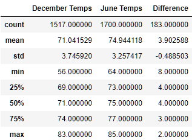

# surfs_up

## Overview 
The purpose of this analysis is to succinctly describe the weather on O'ahu during the summer and winter months. This was analysis used daily weather data pulled from 9 stations spread across the island from the Jan. 1 2010 to Aug. 23 2017. This was performed in order to asses the feasibility of opening an ice cream and surf shop on O'ahu. 

## Results 
The main differences between the winter and summer seasonal weather on O'ahu are:
1. The coldest day on record in the winter is substantially colder than the coldest day on record in the summer
1. The bottom quartile, median, mean, and third quartile all shift up by 3-4 degrees farenheit in the summer, so the average day in december is not too much colder than a similarily average day in june.
1. While the observerd temperatures in December do have a higher degree of spread (indicated by the standard deviation) there is not a very significant change in standard deviation between the two months. This, along with point 2, indicates that the the observed tempertures probably come from a similar distribution that simply shifts up 3-4 degrees in the summer.

The above claims are supported by the summary DataFrame which can be viewed below:


## Summary
In conclusion, the differences between the two months should not concern a potential ice cream and surf shop. Both months have a mean and median temperature that is certianly warm enough to merit both surfing and buying an ice cream afterwards. However, there is a factor which is entirely unaccounted for in this analysis which would impact ice cream sales and surfboard rentals: rainfall. In order to enhance this analysis I would create similar a similar summary DataFrame but instead of querying the oberserved temperature I would query the observed rainfall. Below is a code snippet displaying the two proposed queries:

```python
percip_June = session.query(Measurements.prcp).filter(extract('month', Measurement.date)==6).all()
percip_Dec = session.query(Measurements.prcp).filter(extract('month', Measurement.date)==12).all()
```
